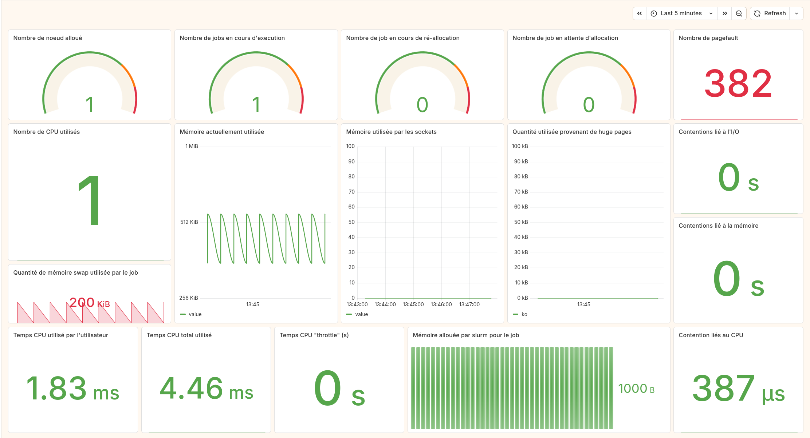

# Cloning the repo
```sh
git clone --recurse-submodules https://github.com/Matth-L/Velvet-Grid.git
```

# Shared partition

.

# Quickstart 

## Build

```sh
# Activate PSI to have pressure information 
sudo grubby --update-kernel=ALL --args="systemd.unified_cgroup_hierarchy=1 psi=1"
````

## Building the container

```sh
docker build -t slurm-docker-cluster --network=host .
```
> slurm is built from source because I added a new metric named "slurm_user_node_active"

> the slurm configuration is in the folder `/slurm`

```sh
docker build -t node_sharing -f ./docker/node_sharing.Dockerfile --network=host .
docker build -t node_only -f ./docker/node_only.Dockerfile --network=host .
docker build -t logstash-with-opensearch-plugins --network=host logstash # building logstash
```

## Launching the POC
```sh
./launch.sh
docker exec -it slurmctld bash
sinfo
squeue
```

## Pipeline
```
[ Compute Node ]
      |
      |  Slurm (slurmctld) exposes OpenMetrics
      |  node_exporter runs on the compute node
      v
[ Prometheus ]
      |
      |  Metrics are scraped
      v
[ Prometheus-Kafka-Adapter ]
      |
      |  Metrics are converted to Kafka messages
      v
[ Kafka ]
      |
      |  Logstash pipeline consumes metrics
      v
[ OpenSearch ]
      |
      |  Data indexed as time-series documents
      v
[ Grafana ]
      |
      |  Dashboards and visualizations
      v
[ User ]
```


# List of services

Multiple services are neede for this pipeline :

- `compute_node`
- `prometheus`, a server, to pull metrics, port used, `9090`
- `prometheus-kafka-adapter`, to transfer data from prometheus to kafka
- `broker`, the kafka broker, port used `9092`
- `opensearch-node`, the database used to store the metrics, port used `9200`
- `logstash`, to stream the data from kafka to opensearch, also apply regex and
 enrich the data a bit
- `grafana`, to display the data, the dashboard to import are located in the
folder [grafana_dahsboards](./grafana_dashboard).

# To see more details of each service

- [opensearch](./md/opensearch.md)
- [kafka](./md/kafka.md)
- [logstash](./md/logstash)
- [grafana](./md/grafana.md)
- [the query logic for grafana](./md/query.md)

# Markdown note

- [metrics comparison](./md/metric_comparison.md)
- [cgroup metric comparison](./md/cgroup_metric_comparison.md)

# Other tools that I tried but did not use

- `Performance Co-Pilot (PCP)`, it does not give enough cgroup information even though it's similar to node_exporter in terms of metrics. There is still a folder named pcp_conf, it's obsolete, but related to the config, I launched it using `/script/launch_pcp.sh` which is commented and not used it the file `restart.sh`.
- `Opensearch data prepper`, an alternative to logstash, it might be because I'm used to logstash but it seems like logstash is easier to configure.
